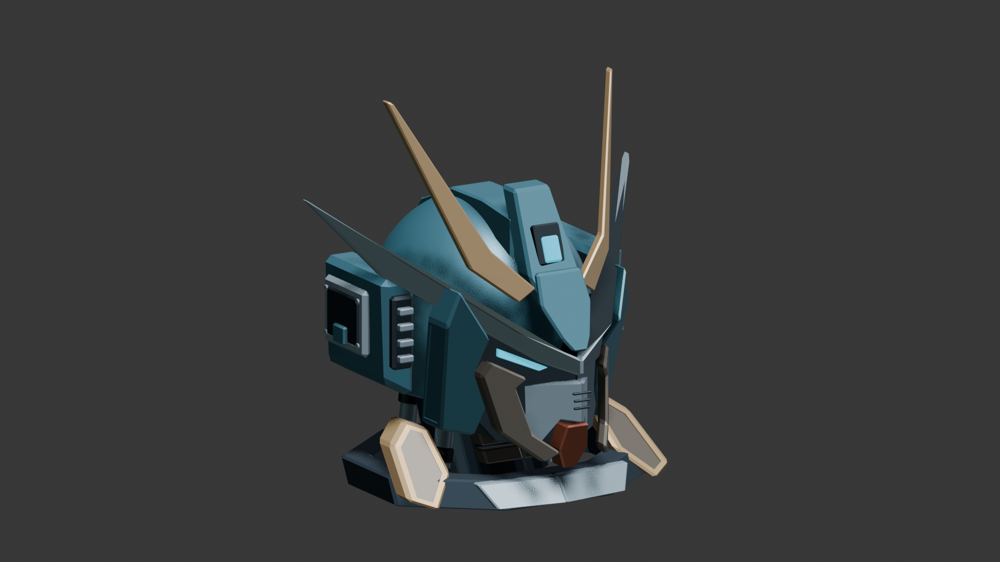

# Highway Phantom

A playable Godot action game about the imaginary runner outside your childhood car window.

## Current Blender helmet study

The editable model is [outputs/Phantom_Reference_Manual.blend](outputs/Phantom_Reference_Manual.blend), saved in Blender 5.2 with its reference images packed into the file. It opens with the helmet isolated; toggle Local View to inspect the rest of the mech blockout. The helmet has received front, side, and three-quarter verification passes; the body and weapons are still earlier studies.

Latest renders: [front](outputs/Phantom_Helmet_Front_Refined.png), [side profile](outputs/Phantom_Helmet_Profile_Refined.png), and [three-quarter view](outputs/Phantom_Helmet_Hero_Refined.png). The approved [construction guide](outputs/phantom_mech_revision6/construction_guide.png) and previous modeling studies are retained in `outputs/`.

## Play

For a fresh clone, install Godot 4.6 or later and import `project.godot`. The local Mac app, browser exports, and engine caches are excluded from Git; the launcher shortcuts below require those local builds. See **Edit in Godot** for browser export instructions.

**Browser testing:** open [Highway Phantom locally](http://127.0.0.1:8067/) and press **Enter**. If the local server is not running, double-click **Play in Browser.command**. Keep that terminal window open while playing. The browser build contains the same game, with bundled fonts, keyboard/mouse controls, and a **Fullscreen** button below the game. Click the game once if keyboard input or sound needs focus. This is a local preview on this computer.

The Mac build remains available at **build/Highway Phantom.app**. No separate Godot installation is required for that development build.

The opening pans from a child in the back seat into the side window. Keep pace with the car through an eastbound sunset expressway, leap between maintenance platforms and over broken road, fight roadside machines, then defeat the Signal Warden while the car waits at a red light. When the signal turns green, the ride continues.

This is a complete playable first-stage prototype, with an opening, traversal and combat, a boss, failure/retry, and a stage ending. It is the foundation for the larger game, not a finished multi-stage release.

| Control | Action |
| --- | --- |
| A / D or left / right arrows | Move alongside the car |
| Space, W or up arrow | Jump; press again to double jump |
| Shift | Dash; brief invulnerability; recharges automatically |
| Hold J or left mouse | Buster fire, with a small amount of aim assistance |
| Hold K, then release | Charged buster |
| Tap L or right mouse three times | Downward slash → rising slash → heavy overhead finisher; reflects enemy shots. The next attack can be queued during a strike. |
| Esc | Pause and controls |
| R | Restart the stage |
| M | Mute/unmute |
| F11 | Fullscreen |
| T while paused or at the ending | Return to title |

On the title, **D** plays the demo, **B** jumps to intersection practice, and **G** toggles assist. Assist prevents the last health point from disappearing. Press **Enter** during the demo to take control. Cyan shards score points; every 500 points reached by collecting a shard restores a health segment. The red-light transition also restores up to two segments.

## What is implemented

- A persistent asymmetric passenger window, glass reflections, window trim, door handle, and a hint of the child at the edge of the frame.
- Painted sunset city art with independent parallax buildings, moving traffic, utility wires, lamps, roadside posts, road markings, and a fast foreground rail. The car owns the camera; everything shares its speed and braking curve.
- A connected cel-shaded armored runner with continuous alternating strides, planted feet, fixed limb proportions, blended jump/dash transitions, independent buster recoil and sword swings, a moving scarf, and fading dash trails.
- Double jump, variable jump height, jump buffering, coyote time, moving platforms, road gaps, fall recovery, combat combos, shards, damage grace periods, and retry.
- Flying drones, tracked sentries, reflectable shots, and a boss with an intensified second phase.
- An original synthesized music loop, road ambience, and twelve sound effects.
- A cinematic opening, title, pause menu, assist option, demo driver, practice shortcut, and ending.

## Edit in Godot

Double-click **Open in Godot.command**, or open `project.godot` with Godot 4.6 or later. The development app bundles the official Godot 4.6 editor executable as its runtime, so the project is editable without another download. The packaged app uses a resource pack; use **Play.command** to run the current editable source after making changes.

The simulation lives in `scripts/run_state.gd`; drawing in `scripts/game_view.gd`; continuous runner poses in `scripts/runner_motion.gd`; armor anchors in `scripts/runner_parts.gd`; character drawing in `scripts/runner_art.gd`; controls and flow in `scripts/main.gd`; audio in `scripts/audio.gd`. Art generation prompts and provenance are in `ART_DIRECTION.md`. Source art is in `assets/`; the provided reference trailer remains at the project root.

The current character component atlas uses a magenta key shader at render time. One connected rig animates those components without swapping between differently proportioned character images. The old painted and pixel atlases are preserved as development history. Generated outputs under `outputs/` are excluded from Godot's import and browser export; model source files there remain editable. The current source and browser export bundle Barlow, Barlow Condensed, and Share Tech Mono under their open font licenses.

The **Web** preset exports to `build/web/index.html`. Run `python3 tools/build_web.py` to rebuild it, or export **Web** from Godot. The cached official single-threaded Web template is in `build/web-templates/`; the exporter can accept another template through `--template`. `tools/serve_web.py` serves only the browser build on loopback at port 8067, with the correct WebAssembly content type. The browser runtime uses the installed Godot 4.6.1 Web template; the project is exported with the bundled 4.6 editor. The generated files can also be served by any static web host supporting WebAssembly.

## Validation and captures

Run the Godot engine with `--headless --path . --script res://tests/test_run.gd` for gameplay behavior checks. `tools/pack.gd` builds the resource pack. `tools/package_mac.py` assembles the Mac development application from the engine path supplied on its command line.

`tools/preview_runner.gd` renders a contact sheet of the current rig. `tools/preview_runner_motion.gd` isolates running, jumping, dashing and attacks in the actual game renderer for a visual movement review. The tests verify roadside foot contact, continuous loop and jump transitions, fixed limb lengths, independent weapon motion, and the existing gameplay behaviors.

`captures/Highway-Phantom-gameplay.mp4` is recorded from the running game. The recorded showcase accelerates the trip to the intersection; ordinary play reaches it after roughly 50 seconds of driving. The demo is assisted. Gameplay screenshots are also in `captures/`.

The Mac app is locally signed for development, not notarized for public distribution. A public release should use the official export templates, a distribution signature, and notarization. Additional stages, enemy variety, fully authored combat animations, controller support, and broader difficulty tuning remain future work.

Godot is distributed under the MIT license: https://godotengine.org/license/
