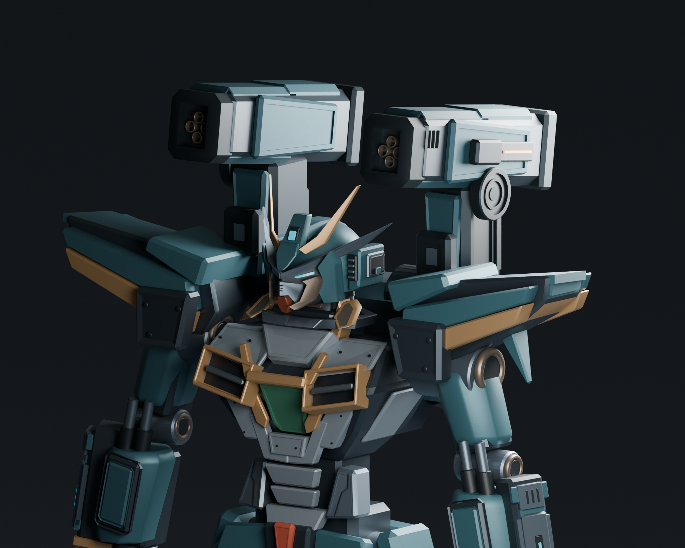

# Phantom assembly refinement — September 7 checkpoint

Work in progress: cannons, shoulders, and backpack refined manually through Blender's interface, using repeated actual-model renders and comparison with the [construction guide](../phantom_mech_revision6/construction_guide.png). No Python, Blender scripts, or generated geometry were used for this refinement session.

## Continue from here

- [Editable working model](checkpoints/Phantom_Reference_Manual.blend)
- [Recoverable Pass30 checkpoint](checkpoints/Phantom_Assemblies_Pass30_Verification_Set.blend), identical to the working model
- [Approved torso checkpoint](checkpoints/Phantom_Approved_Torso_d9aafd5_00.blend), preserved from commit `d9aafd5f046124d7f67f203bc568b5a9111dc64d`
- [Detailed restart notes](RESUME_NOTES.md); older entries describe intermediate and discarded work, so start with the final pause section

The GitHub publication also updates `godot/outputs/Phantom_Reference_Manual.blend` to the working model. On the original Mac workspace, `outputs/Phantom_Reference_Manual.blend` remains the approved source; continue local modeling from this folder's `checkpoints/Phantom_Reference_Manual.blend`.

## Saved changes

- Cannons point forward with an 8-degree upward pitch, with recessed four-bore muzzles, layered housings, corrected paired bearings, and clearance cavities behind the rear service recesses.
- Shoulders have thicker teal and brass layers, swept top coverage, rear armor, underside fins, and graphite root guards with fasteners.
- Backpack has a raised rear panel, octagonal brass surround and power emblem, tapered vent pods, layered covers, hollow angled exhausts, and a recessed lower grille.

Approved torso and helmet work was preserved. The original approved model and torso renders are retained for comparison.

## Actual verification renders

These are actual Blender renders at 2000 × 1600, using Cycles with 128 samples. They document the paused work and are not a claim of final AAA quality.

| View | Image |
| --- | --- |
| Front | [Pass29](renders/Phantom_Assemblies_Front_Pass29.png) |
| Rear | [Pass29](renders/Phantom_Assemblies_Rear_Pass29.png) |
| Three-quarter | [Pass29](renders/Phantom_Assemblies_Hero_Pass29.png) |

The latest side view was rendered and inspected, but its exported file was overwritten during the rear export. The correctly identified rear image is saved under its rear filename. Regenerate the latest side view; the older [Side23 draft](renders/Phantom_Assemblies_Side_Pass23_Draft.png) predates the pod taper and final material changes.

## Remaining work

1. Compare cannon inner-side panel construction against the guide; the current inner faces are simpler than the outer faces.
2. Resolve overly bright cannon housing highlights in the three-quarter view without changing approved torso or helmet materials.
3. Inspect finer backpack mechanical connections, including the two small discs beside the exhausts.
4. Regenerate the latest high-resolution side image and continue close-up comparisons for intersections, normals, shading, and attachment details.

Continue all Blender modeling, materials, lighting, camera adjustments, and rendering through computer use. Earlier checkpoint files include experiments and known defects; use Pass30 to resume.

## File verification

SHA-256 of the working model and Pass30 checkpoint:

`31f46aa9597fd724430bc8a6e0d54f6addcae42b2e660cfbb6dd5fd4fc15f050`

SHA-256 of the approved torso checkpoint:

`2da7a2e05bd5afdfa585c5f5299be445180f3a5d24bfc2d94787de2319d37f89`
