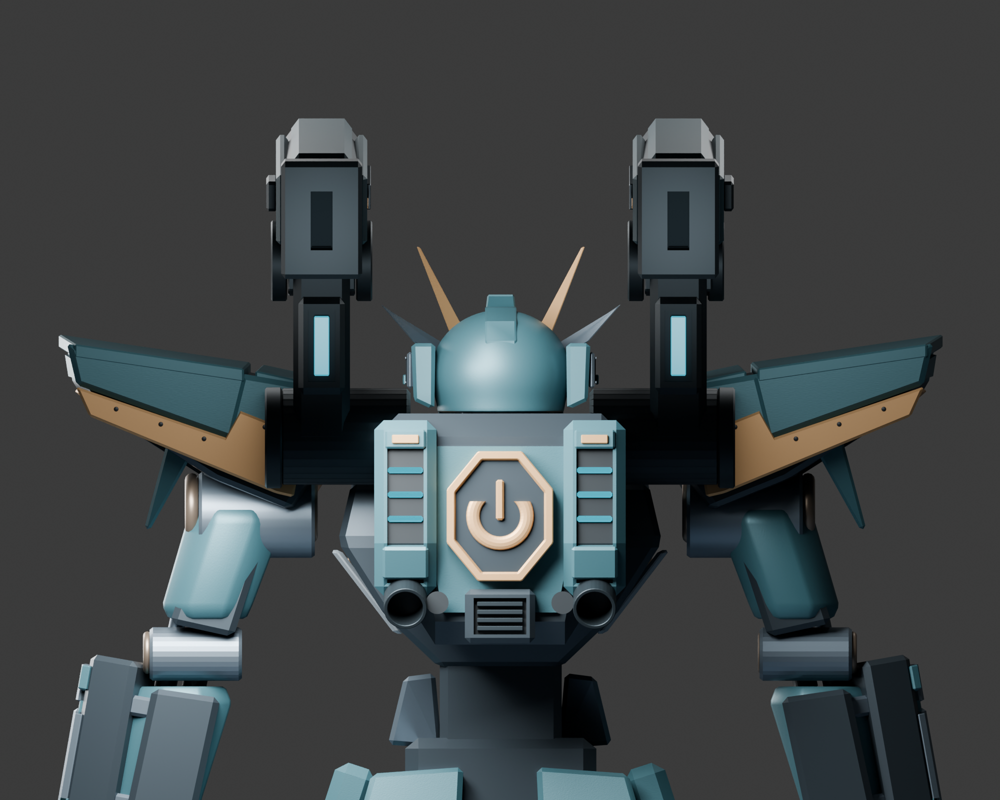

# Phantom assembly refinement — Pass75, September 13 UTC

## Current refinement checkpoint

Pass75 corrects the washed-out exposed shoulder returns using a separate material and object-specific fill. See [PASS75_NOTES.md](PASS75_NOTES.md) for diagnosis, failed trials and current verification. The model's geometry remains the recovered late-pass geometry: shoulders are still boxy in depth, brass edges too thick, and the backpack pale and bulky. The generated studies have not yet been adequately translated into those forms. No finished-quality claim is warranted.

New actual front and hero baselines are `renders/Phantom_Assemblies_Front_PrePass75.png` and `renders/Phantom_Assemblies_Hero_PrePass75.png`. New Pass75 side and rear evidence belongs to this material/light pass; all are 2000 × 1600 with 128 Cycles samples. TrialA/TrialB files are labeled experiments. Generated construction studies15–17 and their critiques remain separately labeled in `supplementary_references`.

The intended current editable remains [checkpoints/Phantom_Reference_Manual.blend](checkpoints/Phantom_Reference_Manual.blend), matched to versioned `Phantom_Shoulders_Pass75_Exposed_Return_Finish.blend` upon checkpoint publication. The local root torso file remains untouched. Read the latest section of [RESUME_NOTES.md](RESUME_NOTES.md), then the historical recovery details below.

## September12 recovery history

Work is unfinished. Resume the late-pass model from [checkpoints/Phantom_Reference_Manual.blend](checkpoints/Phantom_Reference_Manual.blend), not Pass30 and not the root outputs model.

The workspace directory was absent when work resumed on September12; its disappearance has not been explained. The full published repository was freshly downloaded to `/Users/shaumikmondal/programming/prototype-imagination/recovered_published_repository` and verified at commit `93eb9017122360cc03003f23caef1d5df4c62fac`, with clean status and successful Git integrity verification. Published Godot files were restored without overwriting recovery files. The root `outputs/Phantom_Reference_Manual.blend` was restored from the approved torso checkpoint, preserving the original local-file distinction.

## Recovered recent work

- Live Blender scene saved through its UI as [Phantom_Live_Recovery_20260912.blend](checkpoints/Phantom_Live_Recovery_20260912.blend), with a second backup outside this workspace.
- Separately secured autosave in [recovery_20260912](recovery_20260912/RECOVERY_NOTES.md), also backed up outside this workspace.
- UI validation confirmed object96's four innermost shoulder fasteners have median(-0.14,0.067001,7.8), matching the last documented Pass74 correction.
- UI validation confirmed object95's Y dimension approximately1.27 and mesh median(2.8228,0.065405,7.9531), matching the shortened and inward-seated return covers from Pass70/72.
- The retained actual rear render was exported, inspected, and verified to have exactly the same SHA256 as the saved Sept9 Pass74 image.
- All14 generated supplementary references survived and were backed up. They remain construction studies, never actual-model verification.

## Actual model evidence

[Recovered Pass74 rear render](renders/Phantom_Shoulders_Rear_Pass74_Recovered.png), 2000x1600,128Cycles samples. SHA256 `c78368141e3711d293b2bfe8481338db3ef92103099c774eb1ec8ab62e445e49`.

[New actual side render](renders/Phantom_Assemblies_Side_Recovery_20260912.png), rendered from the recovered model at2000x1600/128Cycles samples, exported and visually inspected. SHA256 `1eb6acb8e85d95d07a4e10eff96b9fe189957bee6a33ccfd0a871868b7641235`. Older published renders through Pass29 are historical evidence, not verification of current shoulder/cannon geometry. Unpublished intermediate checkpoints31–74 and most corresponding renders have not been recovered; don't imply otherwise.

Latest editable and matching [verified recovery checkpoint](checkpoints/Phantom_Recovery_20260912_Verified.blend) share SHA256 `00aac2039a65410a373e7b313f75c1f49a96685f086eadb7ccda5809d75798ee`. A third matching copy exists outside this workspace. Blender's resource-packing command reported no new files to pack. No geometry, material, light or camera-transform edits were made during this recovery; the existing side camera was activated for the new render.

## Next modeling work

Continue UI-only modeling and rendering. Preserve approved torso and helmet. Cannon51 refinements were retained; shoulder74 still needs correction of the pale outer tip, oblique inspection of return-cover transitions, and inner/underside mount checks. The backpack remains too pale and blocky, with the two discs beside the exhausts still requiring identification. Continue assembly comparisons against the [original guide](../phantom_mech_revision6/construction_guide.png), then regenerate front, side, rear, hero, and necessary close-ups. No AAA/final claim is justified.

Read the final recovery section of [RESUME_NOTES.md](RESUME_NOTES.md) and [RECOVERY_NOTES.md](recovery_20260912/RECOVERY_NOTES.md). Older published sections describe superseded work through Pass30.

## GitHub backup verified

[Recovery commit3c85a55](https://github.com/shaumik/prototype-imagine/commit/3c85a551911d47acaee6ecba24f2f83754a8425e) is published on main. Both repository canonical models are current; the local root outputs model remains approved torso00. All22 published model/image files were downloaded back from GitHub and matched their SHA256 checksums. The publication also includes restart notes and the original autosave.

Push and verify each meaningful saved refinement pass as work proceeds. Local saves alone do not satisfy the user's checkpoint-backup priority.
